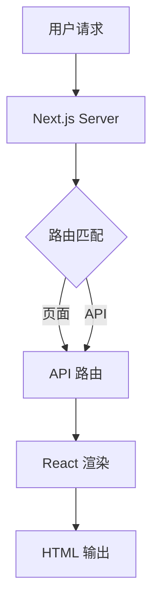

# GitHub 源码解读助手 - 使用示例

## 示例 1：解读 Node.js 项目

### 用户输入

```
帮我解读这个项目的源码：https://github.com/vercel/next.js
```

### AI 执行流程

1. **检查仓库**
   ```bash
   ✓ 解析 GitHub 仓库: vercel/next.js
   ✗ 仓库不在本地
   ```
   
   AI 会提示：
   ```
   这个仓库还没克隆到本地。需要我先克隆吗？
   克隆命令：git clone https://github.com/vercel/next.js.git
   目标目录：~/Documents/coding/github/next.js
   ```

2. **用户确认克隆后**
   ```bash
   cd ~/Documents/coding/github
   git clone https://github.com/vercel/next.js.git
   ```

3. **创建分析环境**
   ```bash
   python3 skills/github-code-interpreter/scripts/bootstrap_github_analysis.py \
     'https://github.com/vercel/next.js' \
     ~/Documents/working
   ```

4. **生成文档**
   - 阅读 README.md、package.json
   - 分析目录结构
   - 统计代码量
   - 生成两份文档

5. **输出结果**
   ```
   ✓ 解析 GitHub 仓库: vercel/next.js
   ✓ 仓库已在本地: ~/Documents/coding/github/next.js
   ✓ 当前分支: canary
   ✓ 创建分析目录: ~/Documents/working/github-analysis/next.js
   ✓ 生成结构文件: structure.txt
   ✓ 生成元数据文件: metadata.json
   
   解读文档已保存到：
   - ~/Documents/working/github-analysis/next.js/next.js_源码解读.md
   - ~/Documents/working/github-analysis/next.js/next.js_快速上手.md
   
   ✓ 1 小时后的复查任务已安排
   ```

### 生成的文档内容

#### next.js_源码解读.md

```markdown
# Next.js 源码解读

## 项目基本信息

- **仓库地址**: https://github.com/vercel/next.js
- **Star 数**: 115k+
- **最后更新**: 2026-03-13
- **技术栈**: TypeScript、React、Node.js
- **代码量**: TypeScript 1,138,627 行

## 一句话总结

Next.js 是一个 React 框架，提供了服务端渲染、静态生成、路由等功能。

## 使用场景

### 这个项目解决什么问题

- React 的 SSR 复杂度
- 路由管理
- 性能优化
- SEO 优化

### 适用场景

- 需要 SSR 的 React 应用
- 静态网站生成
- 混合渲染应用

## 核心原理

### 整体架构



### 关键模块

#### 1. 路由系统
- 文件系统路由
- 动态路由
- 中间件

#### 2. 渲染引擎
- SSR
- SSG
- ISR

## 对悟鸣的启发

### 结合当前岗位

- **Agent 开发**: 可以借鉴 Next.js 的插件系统设计
- **工具链**: 可以参考其构建流程优化

### 结合最近研究

- **MCP**: Next.js 的中间件机制与 MCP 的管道设计有相似之处
- **Agent Skills**: 可以借鉴其模块化思想

## 术语解释

| 术语 | 解释 |
|------|------|
| SSR | 服务端渲染 |
| SSG | 静态站点生成 |
| ISR | 增量静态再生成 |
```

#### next.js_快速上手.md

```markdown
# Next.js 快速上手

## 环境要求

- Node.js 18.17+
- npm 或 yarn 或 pnpm

## 安装步骤

### 1. 创建项目

```bash
npx create-next-app@latest my-app
cd my-app
```

### 2. 安装依赖

```bash
npm install
```

### 3. 运行开发服务器

```bash
npm run dev
```

访问 http://localhost:3000

## 快速体验

### 创建第一个页面

```tsx
// app/page.tsx
export default function Home() {
  return <h1>Hello, Next.js!</h1>
}
```

### 添加 API 路由

```ts
// app/api/hello/route.ts
export async function GET() {
  return Response.json({ message: 'Hello' })
}
```

## 常见问题

### Q1: 端口被占用

```bash
# 使用其他端口
npm run dev -- -p 3001
```

### Q2: 构建失败

```bash
# 清除缓存
rm -rf .next
npm run build
```

## 下一步学习

1. 阅读 `packages/next/src/` 目录
2. 研究路由系统实现
3. 学习渲染流程
```

## 示例 2：解读 Python 项目

### 用户输入

```
分析这个项目的原理：https://github.com/langchain-ai/langchain
```

### AI 执行

类似流程，但会：

1. 识别为 Python 项目
2. 分析 `setup.py` 或 `pyproject.toml`
3. 重点关注 Python 特有的结构（包、模块）

### 输出差异

- **技术栈** 显示为 Python
- **代码量** 统计 Python 文件
- **快速上手** 使用 pip/poetry

## 示例 3：解读 Rust 项目

### 用户输入

```
生成这个项目的学习报告：https://github.com/rust-lang/rust
```

### 注意事项

AI 会提示：

```
⚠️ 这个项目非常大（Rust 编译器本身），建议：
1. 明确分析范围（如只分析某个子模块）
2. 或者选择一个较小的 Rust 项目

是否继续完整分析，还是聚焦某个模块？
```

## 复查示例

### 1 小时后自动触发

```bash
# 运行复查脚本
bash skills/github-code-interpreter/scripts/review.sh \
  ~/Documents/working/github-analysis/next.js
```

### 输出

```
================================================
GitHub 源码解读 - 复查任务
================================================
分析目录: ~/Documents/working/github-analysis/next.js
时间: 2026-03-13 10:30:00

✓ 找到元数据文件: metadata.json
✓ 仓库路径: ~/Documents/coding/github/next.js
✓ 仓库已是最新

检查文档文件...
✓ 找到解读报告: next.js_源码解读.md
  当前行数: 350
✓ 找到快速上手文档: next.js_快速上手.md
  当前行数: 180

================================================
复查任务清单
================================================

1. 读取当前的解读报告和快速上手文档
2. 重新审视仓库结构（structure.txt）
3. 补充遗漏的内容：
   - 架构图或流程图（Mermaid）
   - 关键模块的详细说明
   - 使用场景的补充
   - 设计思想的深入分析
   - 对悟鸣的启发（结合岗位和研究）
4. 检查快速上手文档的准确性
5. 在文档末尾添加/更新复查记录

复查准备完成，可以开始完善文档了！
================================================
```

### AI 复查后更新

在 `next.js_源码解读.md` 末尾添加：

```markdown
## 复查记录

### 2026-03-13 初版
- 完成基础架构分析
- 生成核心原理文档
- 创建快速上手指南

### 2026-03-13 复查 1
- 补充了 Next.js 13+ 的 App Router 架构图
- 优化了 SSR/SSG/ISR 的对比说明
- 添加了与 Agent 开发相关的启发
- 修正了快速上手文档中的命令错误
```

## 技巧和最佳实践

### 1. 选择合适的仓库大小

- **小型项目**（< 10K 行代码）- 可以完整分析
- **中型项目**（10K-100K 行）- 可以完整分析，但需要时间
- **大型项目**（> 100K 行）- 建议聚焦某个模块

### 2. 明确分析重点

```
✓ 好的请求：
"分析 next.js 的路由系统设计"
"解读 langchain 的 chain 机制"

✗ 不太好的请求：
"分析 next.js 的所有代码"
```

### 3. 结合实际需求

- 如果要学习架构，重点关注模块划分
- 如果要上手使用，重点关注快速上手文档
- 如果要借鉴设计，重点关注设计思想部分

### 4. 利用复查机制

- 初版快速产出
- 复查时深入细节
- 持续迭代完善

## 故障排查

### 问题 1：仓库不在本地

**解决方法**：
```bash
cd ~/Documents/coding/github
git clone <repo_url>.git
```

### 问题 2：脚本运行失败

**检查**：
- Python 版本（需要 Python 3.7+）
- 是否安装了 tree 命令
- 仓库路径是否正确

### 问题 3：文档生成不完整

**解决方法**：
- 查看错误日志
- 手动补充缺失部分
- 等待复查任务自动完善

## 总结

GitHub 源码解读助手可以帮你：

1. **快速理解**开源项目的核心原理
2. **生成高质量**的学习文档
3. **获得个性化**的启发和建议
4. **持续完善**文档内容

让学习开源项目变得更高效！
